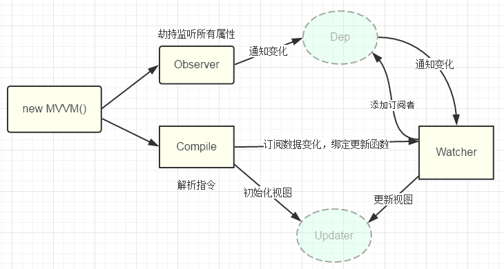

# vue
vue源码解析及一些基本功能实现原理

# vue底层原理关系图



vue是通过Object.defineProperty()方法对数据劫持来实现双向绑定的。

* 其中通过Observer劫持监听所有属性，当数据有变化时，通知Dep。
* 指令解析器Compile对每个元素的指令进行扫描和解析，然后对指令的模板进行数据替换，执行事件，并绑定Update函数，同时会进行依赖收集。
* Watcher 作为Dep和Compile连接器能够收集所有的属性，并且订阅属性的变动，从而执行相应的回调函数 

#### JS代码
```javascript
class Vue{
  constructor(option){
    this.$data = options.data;
    this.$options = options;

    this.observe(this.$data)

  }
  observe(data){
    if(!data || typeof data !== 'object'){
      return;
    }
    Object.keys(data).forEach(key => {
      this.observe(value)
      this.setDefineReactive(data,key,data[key])
    })
  }
}
```
设置监听函数，遍历所有的属性，并添加递归函数，从而拿到多层嵌套的数据。然后对每一个数据添加劫持函数，并进行数据的响应化。下面是数据的响应化函数**setDefineReactive**

```javascript
defineReactive(data,key,value){
  const dep = new Dep()
  Object.defineProperty(data,key,{
    configurable:true,//可配置性
    enumerable:true,//可遍历性
    set(newVal){
      if(newVal == value) return;
      value = newVal;
      dep.notify();
    },
    get(){
      return value
    }
  })
}
```
**Object.defineProperty**函数会劫持属性原有**set****get**方法，从而监听到数据的变化，然后执行**dep.notify**通知函数。**下面设置Dep**
```javascript
class Dep{
  constructor(){
    this.deps = []
  }
  addDep(dep){
    this.deps.push(dep)
  }
  notify(){
    this.deps.forEach(dep = dep.update())
  }
}
```
Dep的作用主要是收集依赖，并设置通知函数，下面来设置**Watcher**
```javascript
class Watcher{
  constructor() {
    // 将当前watcher实例指定到Dep静态属性target
    Dep.target = this;
  }
  update() {
    console.log("属性更新了");
  }
}
defineReactive(data,key,value){
  const dep = new Dep()
  Object.defineProperty(data,key,{
    get(){
      Dep.target && dep.addDep(Dep.target)
      return value
    }
  })
}
```
将Watcher指向Dep的静态属性target从而将依赖收集添加到Dep的deps属性里面

# 接下来进行编译及对**v- @ v-text v-html**等指令进行插值，事件的处理